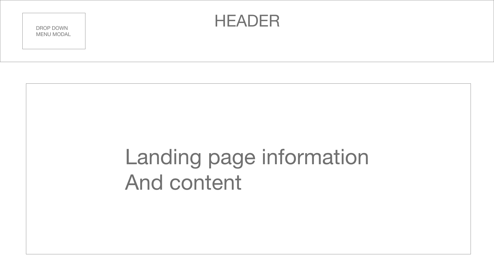
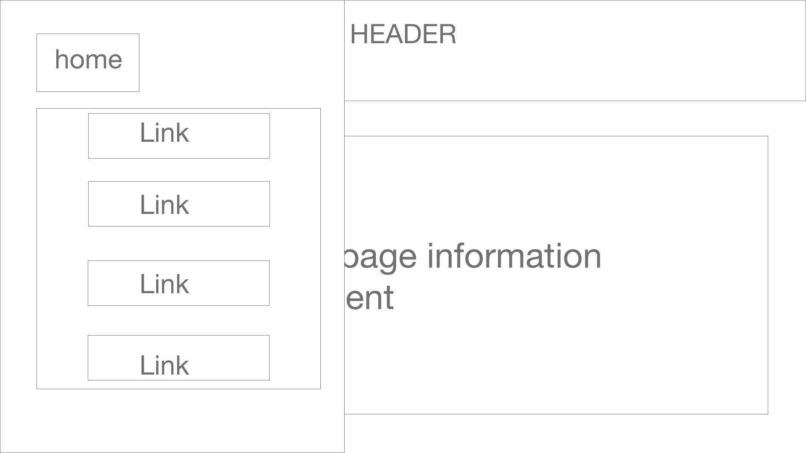
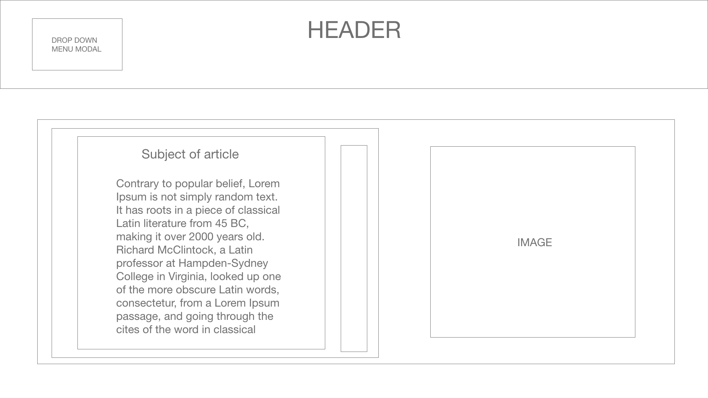

# Governing Artificial Intelligence: Upholding Human Rights & Dignity  
### Mark Latonero
the aforementioned report depicts examples or Artificial Intelligence being used, misused, and response from corporate and political leaders.
___

What is the purpose of the website:
 
To summarize and highlight impacting information of this article. 
 
Who is your audience:
 
Our target audience is professionals in the IT industry working with or creating artificial intelligence. 
 
What features make your website unique: 
 
Teammates and tasks they were responsible for: 
 
Visa: 
 
Omar: Home/landing page
 
Brian:
 
Rocio: Wireframe, README, "A HUMAN RIGHTS FRAME FOR AI RISKS AND HARMS" Page 

## Wireframe
Landing page:

__________
Modal in landing page:

__________
Pages content:

